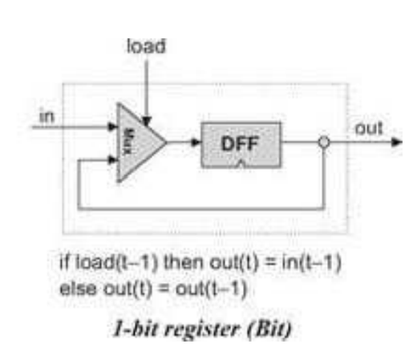
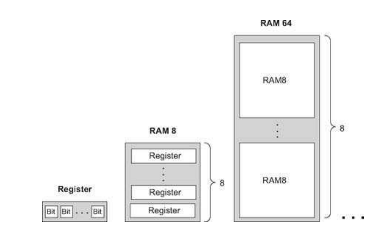
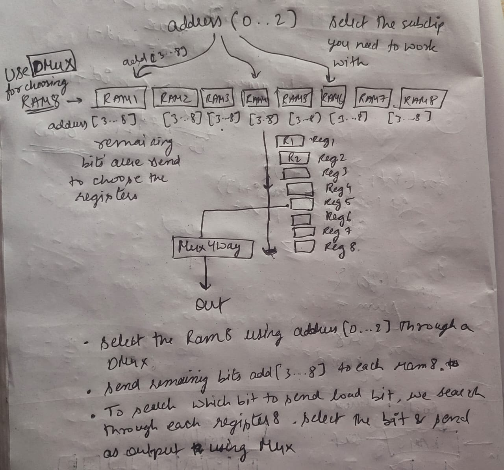

### NAND 2 TETRIS

Resources used: 

1. The Elements of Computing Systems.pdf
2. (official) https://www.youtube.com/watch?v=rg0FIjUf2OE&list=PLrDd_kMiAuNmSb-CKWQqq9oBFN_KNMTaI&index=9
3. https://www.nand2tetris.org/course
4. (sensible tutorial) https://www.youtube.com/watch?v=tRT1O6mLTZw&list=PLu6SHDdOToSdD4-c9nZX2Qu3ZXnNFocOH
5. (ben eater) https://www.youtube.com/watch?v=HyznrdDSSGM&list=PLowKtXNTBypGqImE405J2565dvjafglHU&index=1
6. (for ALU) https://www.youtube.com/watch?v=duVn5JTKnBo&list=PLxrmhEW0PGtW6nGXE1f-H4hFKta4p_R55

roadmap: 
Terminologies: 

## Logic-Gates

- build all gates from NAND gate (to handle 0s and 1s)
theorem: Any boolean function can be written using Nand Gate
Proof: boolean fnx -> truth table -> And/Or/Not (NAND)

# Building a chip

So firstly chips are designed and tested in HDL/VHDL (Hardware Descriptive language)

- **busses:** 

- **multiplexer:** its like a selector, for three Inp gate and one Outp gate -> if selector = 0 then output = a else output = b

for a m-way n-gate multiplexer (m = no. of inputs, n = bits of input busses)
for ex: 4-way 16-bit multiplexer

__for four Inp, one Outp gate -> if selector = 00 the ouptput = a else if selector = 01 output = b else if selector = 10 output = c else output = d__

Completed __projects/01__

## Building the ALU

- numbers are kept in electronics as high and low (0 or 1), hence base 2
- **signed/unsigned bits:**

# Adders

- Half adder: 

- Full adder: 

- 16 bit adder:

- 16 bit Incrementor: 

- **ALU:**

Completed __projects/02__

## Building Memory

We will build memory by saving input and utilizing it later as output. For this we require time, an internal clock of the cpu (master clock). It delivers a train of alternating signals (0s & 1s state)

- using flip-flops : DFF (single bit data flip-flop) 
`output(t) = input(t-1)`

- registers : its a storage device that can store or remember value over time. Its implemented by using flip-flops but how can it remember the same value over time? Simple, we'll just keep feeding the flip-flops output as the input

**load selects which register to access**
**DFF handles time**

- storage in RAM can be constructed by storing multi-bit registers (16 or 32 bit). In the form of an array, registers are given an address and accessed later on.

- Counters: it generates the address according to computer clock

- for accessing values we will use counters. we use feedbacked not gate for creating an oscillator (for the **clock**)

# Building RAM

- We use DMux selector for selecting load & address of which register(out of 8) to write in
`load==1 (write) load==0 (dont write)`
`address(t)`

- Using mux to select which output to display (after writing or without writing)

- rest RAM's are made by stacking up previous bit rams

- RAM64 uses address[0..2] for choosing registers in 1st RAM8 (why LSB? first priority is given to finding the ram) and address[3..5] for choosing the nth RAM8

*play silicon zero for more understanding*
- *counters/ram/register part*