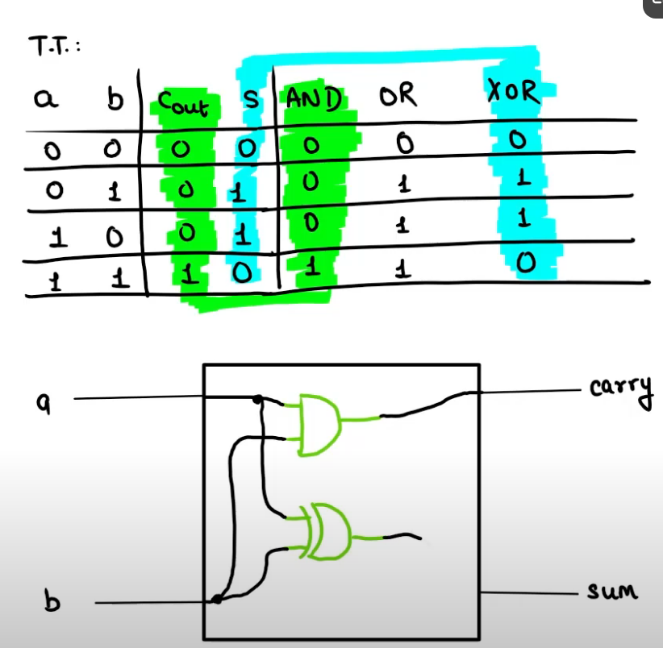

### NAND 2 TETRIS
Resources used: 
1. The Elements of Computing Systems.pdf
2. (official) https://www.youtube.com/watch?v=rg0FIjUf2OE&list=PLrDd_kMiAuNmSb-CKWQqq9oBFN_KNMTaI&index=9
3. https://www.nand2tetris.org/course
4. (sensible tutorial) https://www.youtube.com/watch?v=tRT1O6mLTZw&list=PLu6SHDdOToSdD4-c9nZX2Qu3ZXnNFocOH
5. (ben eater) https://www.youtube.com/watch?v=HyznrdDSSGM&list=PLowKtXNTBypGqImE405J2565dvjafglHU&index=1
6. (for ALU) https://www.youtube.com/watch?v=duVn5JTKnBo&list=PLxrmhEW0PGtW6nGXE1f-H4hFKta4p_R55

roadmap: 
Terminologies: 

## Logic-Gates

- build all gates from NAND gate (to handle 0s and 1s)
theorem: Any boolean function can be written using Nand Gate
Proof: boolean fnx -> truth table -> And/Or/Not (NAND)

# Building a chip
So firstly chips are designed and tested in HDL/VHDL (Hardware Descriptive language)

- **busses:** 
- **multiplexer:** its like a selector 
for three Inp gate and one Outp gate -> if selector = 0 then output = a else output = b

for a m-way n-gate multiplexer (m = no. of inputs, n = bits of input busses)
for ex: 4-way 16-bit multiplexer

__for four Inp, one Outp gate -> if selector = 00 the ouptput = a else if selector = 01 output = b else if selector = 10 output = c else output = d__

Completed __projects/01__

## Building the ALU

- conversion of decimal -> binary (since gates I/O in binary)
- **signed binary:**

# Adders
- Half adder: 
- Full adder: 
- 16 bit adder:
- 16 bit Incrementor: 
- ALU:

Completed __projects/02__